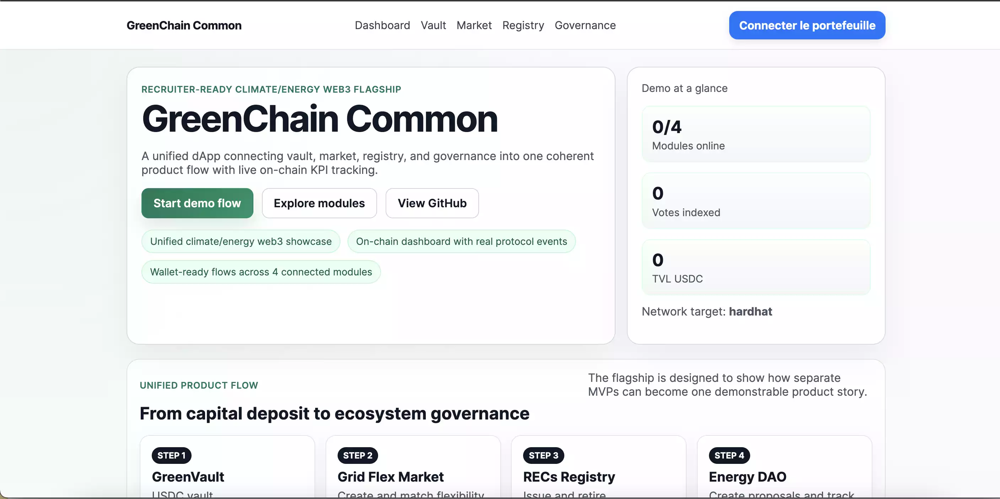
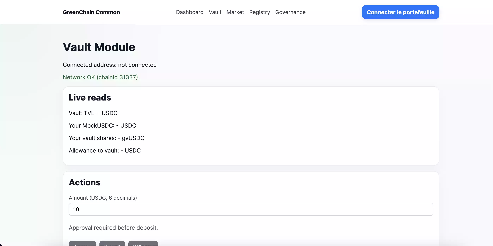
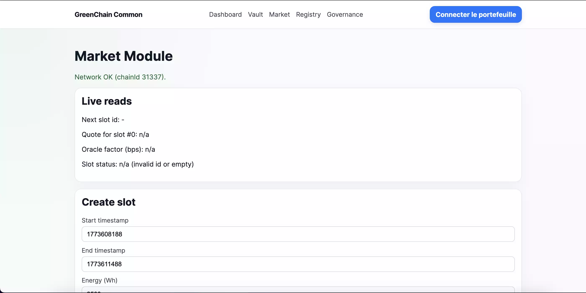
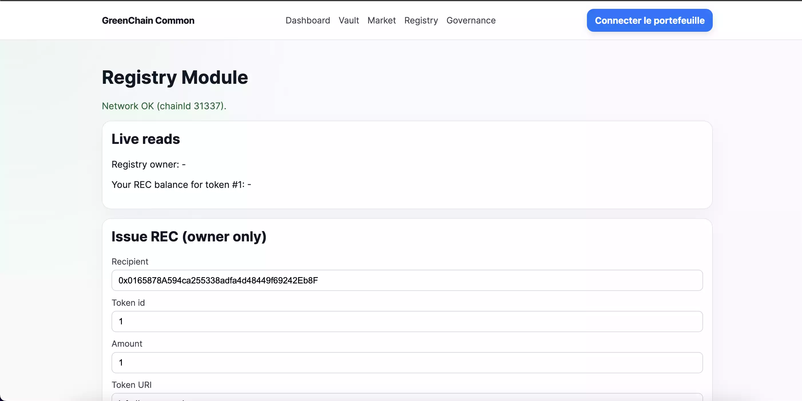
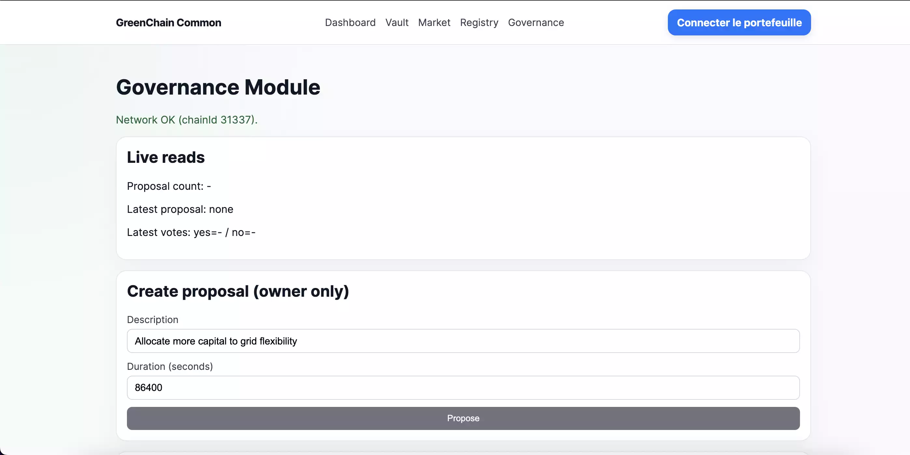

# GreenChain Common

GreenChain Common est une dApp flagship web3 orientée climate/energy qui relie un vault, un market, un registry et une gouvernance dans un parcours utilisateur unifié avec des KPI on-chain consolidés.

## Liens rapides

- Script de démo : [`docs/Demo_Script.md`](docs/Demo_Script.md)
- Case study freelance : [`docs/Case_Study_Freelance.md`](docs/Case_Study_Freelance.md)
- Frontend : [`frontend/`](frontend)
- Backend : [`backend/`](backend)

## Vue d'ensemble

Les briques web3 orientées climat et énergie sont souvent séparées, ce qui rend difficile la présentation d'une vision globale et cohérente du produit.

GreenChain Common répond à cet enjeu en unifiant plusieurs modules au sein d'une seule dApp : vault, market, registry et gouvernance.

L'utilisateur peut ainsi suivre un parcours complet et consulter des KPI on-chain consolidés directement depuis GreenChain Common.

## Pourquoi ce projet

GreenChain Common a été conçu comme un projet de démonstration full-stack web3 orienté produit. L'objectif n'est pas seulement de montrer des smart contracts isolés, mais une expérience cohérente reliant plusieurs briques métier dans une interface unique.

Le projet permet de démontrer rapidement :

- une intégration frontend web3 complète avec wallet, lectures et écritures de contrats,
- une UX transactionnelle lisible pour un utilisateur final,
- une agrégation d'events on-chain pour produire des KPI et une activité récente,
- une vision produit unifiée à partir de plusieurs MVP distincts.

## Modules principaux

- **Vault** : module de dépôt et de retrait qui permet à l'utilisateur de placer du capital dans le coffre du protocole.
- **Market** : module de marché qui permet de créer et de faire correspondre des slots de flexibilité énergétique.
- **Registry** : module de registre qui permet d'émettre et de retirer des certificats environnementaux de type REC (contrat ERC-1155).
- **CarbonCredits1155** : second contrat ERC-1155 (démo) qui minte des unités de « crédit carbone » en même temps qu’une émission REC (`issue`), pour le pitch climat / tokenisation. Le dashboard et la page Registry affichent les soldes et l’agrégation d’events `CarbonCreditsMinted`. Ce n’est pas un crédit carbone réglementé ; le retrait d’un REC ne brûle pas ces jetons dans cette MVP.
- **Governance** : module de gouvernance qui permet de créer des propositions, voter et piloter certaines décisions de l'écosystème.

## Parcours unifié

1. L'utilisateur dépose du capital dans le Vault.
2. Des slots de flexibilité énergétique peuvent ensuite être créés ou matchés dans le Market.
3. Les résultats de cette activité peuvent être représentés dans le Registry via l'émission ou le retrait de certificats environnementaux (REC).
4. La Governance permet enfin de créer des propositions, voter et piloter certaines décisions de l'écosystème.

En résumé :

`Vault -> Market -> Registry -> DAO`

## Stack technique

- **Frontend** : Next.js, TypeScript
- **Web3 frontend** : wagmi, viem, RainbowKit
- **Backend / smart contracts** : Hardhat, Solidity
- **Standards / librairies** : OpenZeppelin

## Installation locale

1. Installer les dépendances du backend :

```bash
cd backend
npm install
```

2. Installer les dépendances du frontend :

```bash
cd ../frontend
npm install
```

3. Lancer le node Hardhat local :

```bash
cd ../backend
npx hardhat node
```

4. Déployer les contrats en local dans un autre terminal :

```bash
cd /Users/christophechollet/Desktop/GreenChainCommon/backend
npx hardhat run scripts/deploy-local.ts --network localhost
```

5. Lancer le frontend :

```bash
cd /Users/christophechollet/Desktop/GreenChainCommon/frontend
npm run dev
```

## Démonstration du parcours

1. Connecter le wallet.
2. Aller sur Vault et effectuer `Approve`, puis `Deposit`.
3. Aller sur Market et créer ou matcher un slot.
4. Aller sur Registry et émettre ou retirer un REC.
5. Aller sur Governance et créer ou voter une proposition.
6. Revenir au dashboard pour voir les KPI évoluer.

## Démo et captures

Le projet est pensé pour être montré en live, en capture d'écran ou en courte vidéo.

Le **site portfolio** (Next.js, blog, page projets) est un **dépôt séparé** sur la machine : par ex. `../christophe-portfolio` à côté de ce dossier (GitHub : dépôt `portfolio-starter-kit` ou équivalent).

Éléments recommandés pour le portfolio :

- une capture du dashboard principal,
- une capture d'un module transactionnel en action,
- une courte vidéo de démo de 2 à 4 minutes basée sur [`docs/Demo_Script.md`](docs/Demo_Script.md).

Captures actuellement disponibles :

### Dashboard



### Vault



### Market



### Registry



### Governance



## Ce que ce projet démontre

- Intégrer une dApp full-stack web3 reliant plusieurs smart contracts à un frontend et à un wallet.
- Mettre en place une UX transactionnelle simple, avec des actions comme l'approbation, le dépôt, le vote et la gestion des retours utilisateur.
- Savoir lire et agréger des events on-chain afin d'alimenter un dashboard et des KPI.
- Relier plusieurs briques produit dans un parcours utilisateur unifié et cohérent.

## Limites actuelles

- L'environnement actuel est principalement pensé pour une exécution locale et de démonstration.
- Certains flux reposent sur des mocks, notamment `MockUSDC` et `MockGridOracle`.
- La logique reste volontairement MVP sur certains modules.
- Les jetons `CarbonCredits1155` sont une démo produit : pas de marché secondaire, pas de lien kg CO₂ réel, pas de burn synchronisé avec le `retire` des REC.
- Le projet n'intègre pas encore d'infrastructure plus avancée de type indexing backend, environnement de production ou couverture de tests plus poussée.

## Prochaines étapes

- Déploiement sur le réseau Sepolia.
- Amélioration de l'UI/UX.
- Ajout de tests plus poussés.
- Réalisation d'une démo vidéo et d'une case study.
- Mise en place d'un indexing plus avancé.

